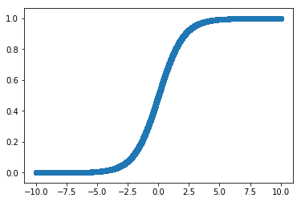

```python
import numpy as np
import matplotlib.pyplot as plt
%matplotlib inline
```

# Logistic Regression

Logistic regression provides us with a convenient way to take all of our ideas from linear regression and apply them to classification. With logistic regression, we will be attempting to predict binary classification of 0 or 1. To do this, we will use logistic regression to estimating the probability of cases falling into one group or another. The main mechanism underlying this is the useful 'S shaped', sigmoid function.

$S(x) = \frac{1}{1+e^{-x}}$


```python
#Plot the sigmoid function
x = np.linspace(start = -10, stop = 10, num=10**5+1)
y = 1/(1+np.e**-x)

plt.scatter(x,y);
```





As you can see, this is a useful function for taking a variable and mapping it to a set range of 0 and 1. In turn, we will use these output values as probabilities for class membership. With that, we can then set a cutoff such as 0.5. Outputs below that will be given one label, such has 'not a member', while outputs at or above the threshold will be given the converse label such as 'is a member'.

With that, let's look at logistic regression from a practitioner's standpoint.
